# kerastcvai
kerastcvai : # Text Classification # DNN # RNN # CNN

## Objective
- To create a text classification datasets using BigQuery.
- To tokenize and integerize a corpus of text for training in Keras.
- To do one-hot-encodings in Keras.
- To use embedding layers to represent words in Keras.
- To use bag-of-word representation for sentences.
- To use DNN/CNN/RNN model to classify text in keras.
- To create Keras Sequential model with three layers (build_dnn_model)
    - 1st layer : Embedding transforming the word integers into dense vectors
    - 2nd layer : Lambda to create a bag-of-words representation of the sentences by computing the mean
    - 3rd layer : Dense softmax layer that returns the probabilities for each class
- To build RNN model which predicts the article class
- To create CNN model for text classification

## Keras Text Classification

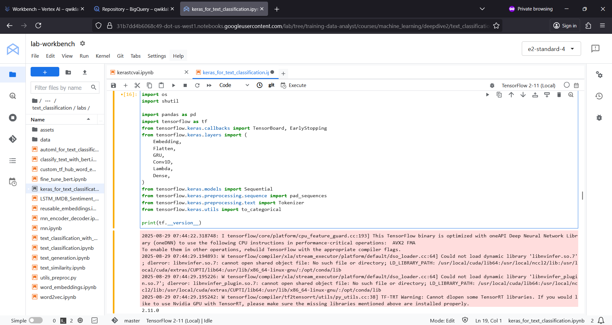

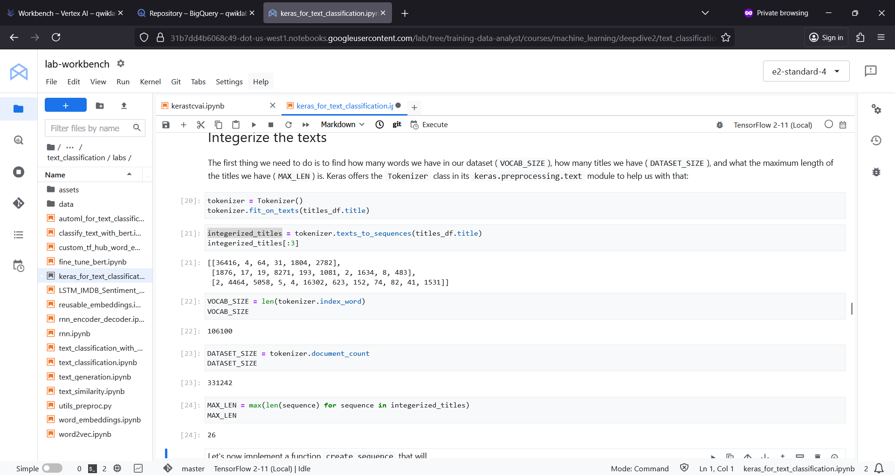

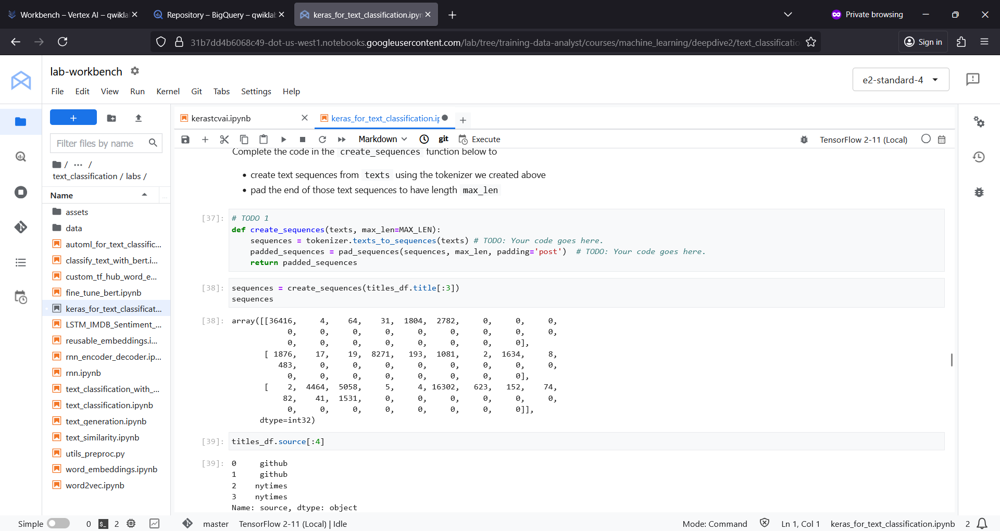

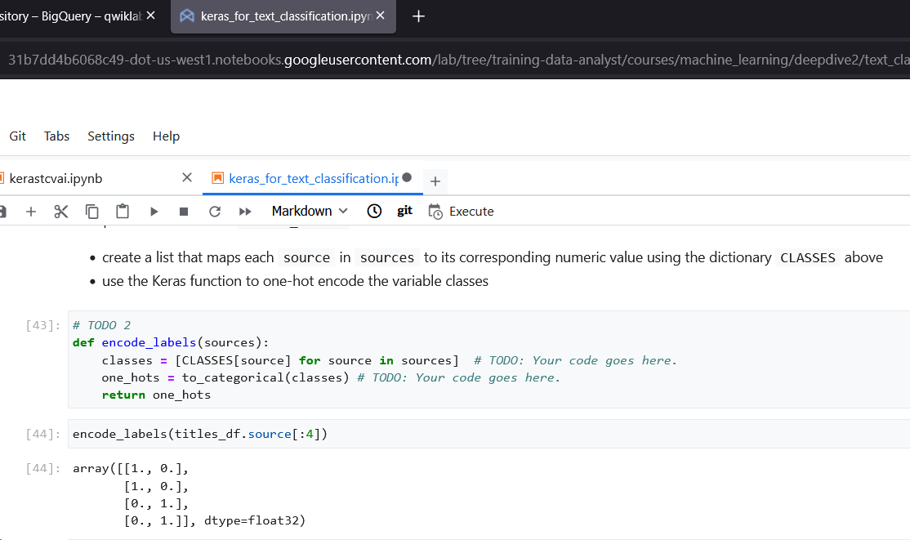

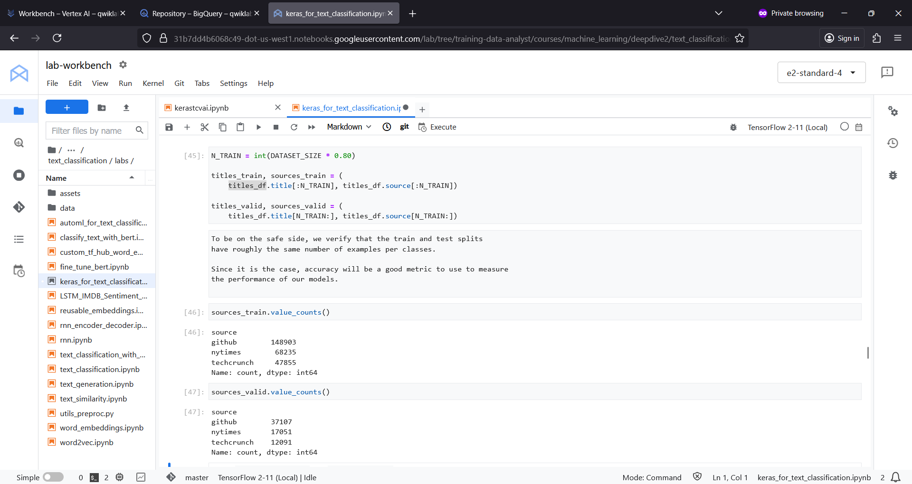

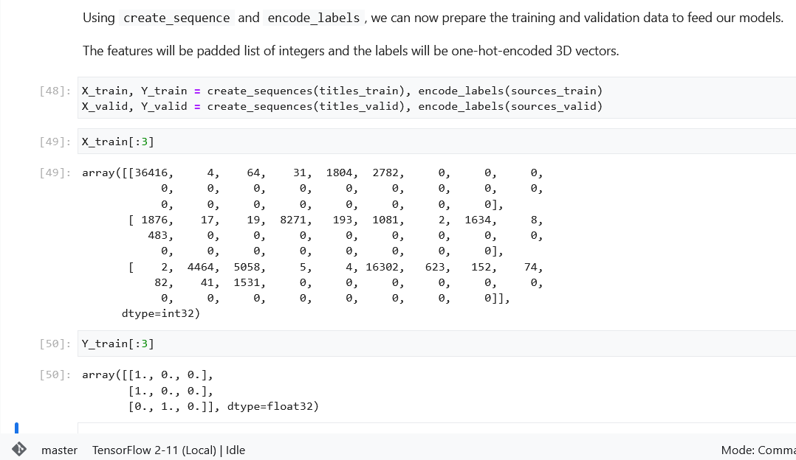

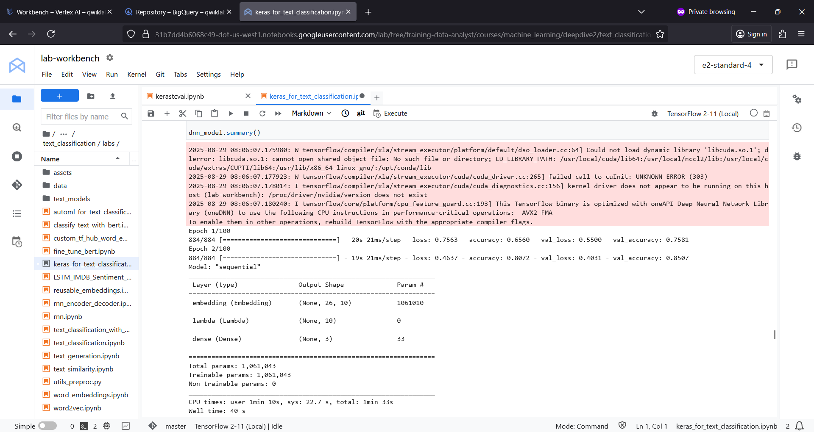

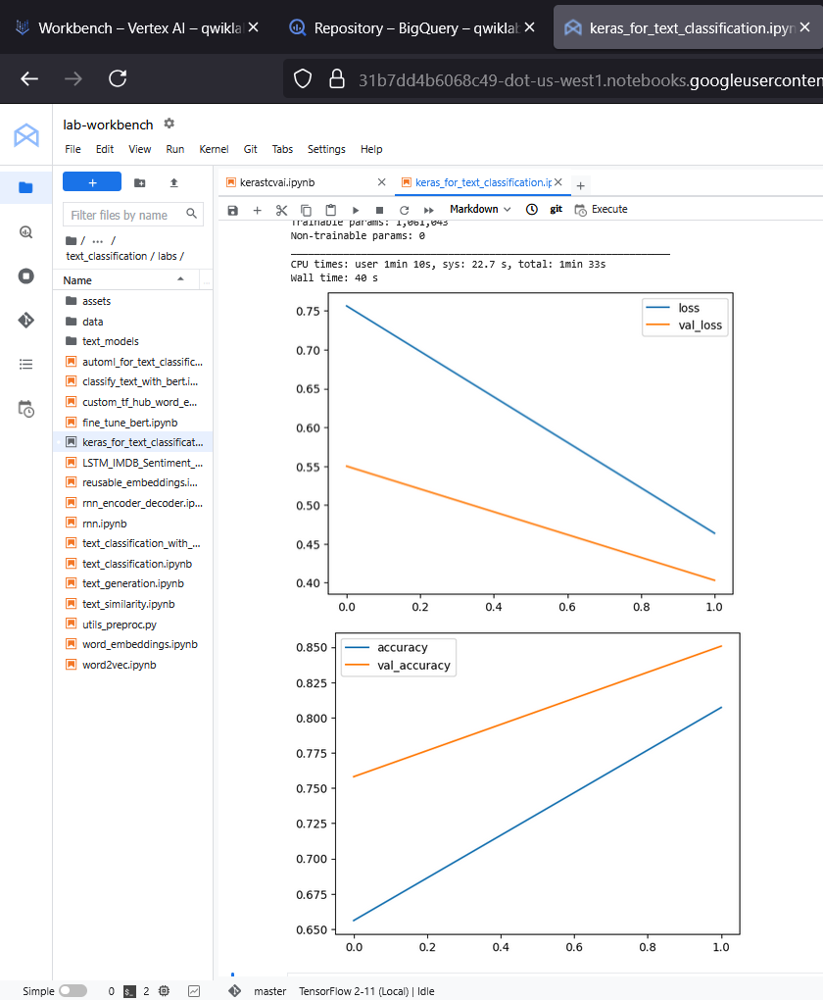

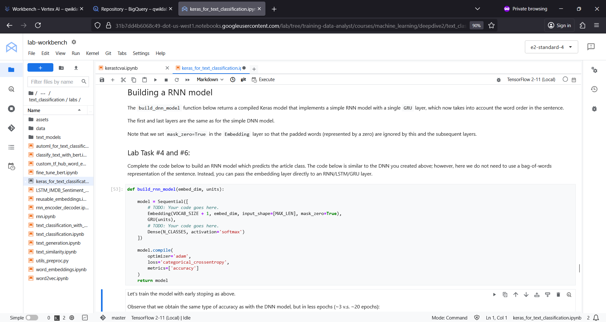

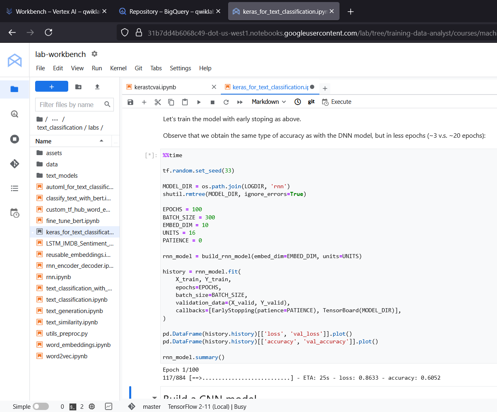

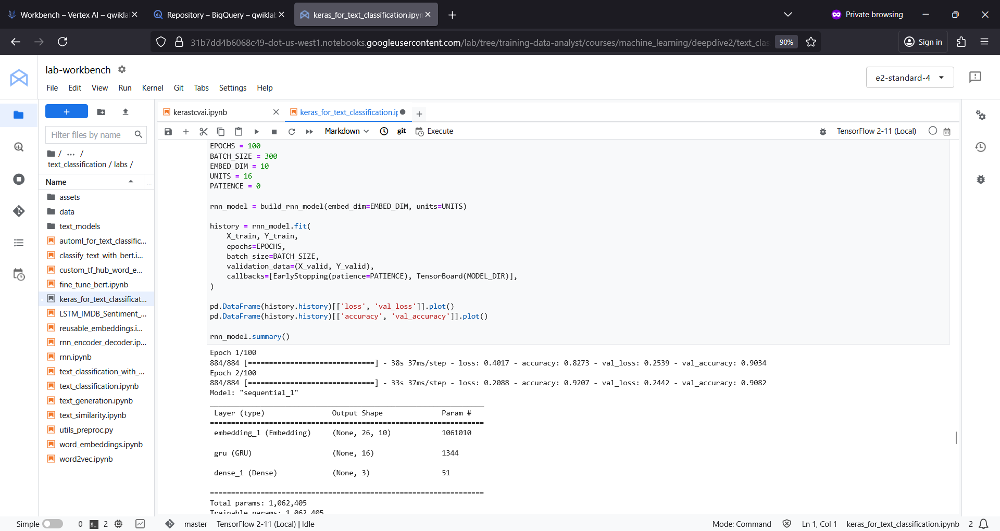

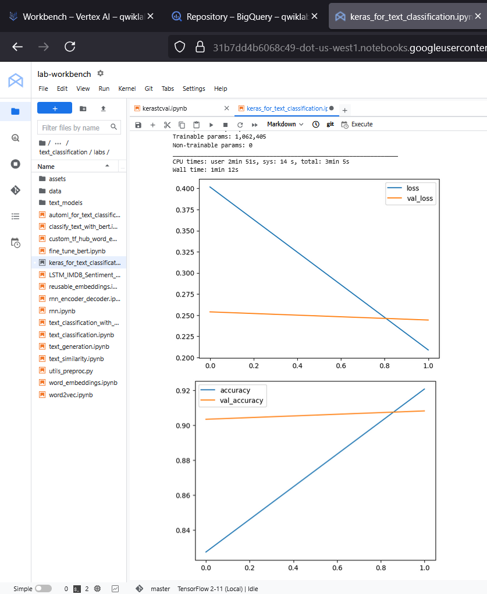

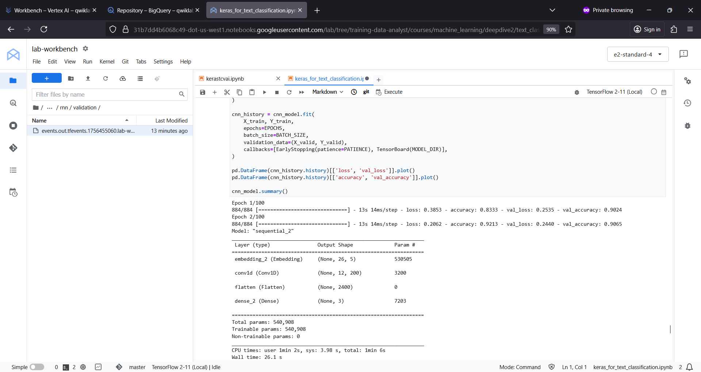

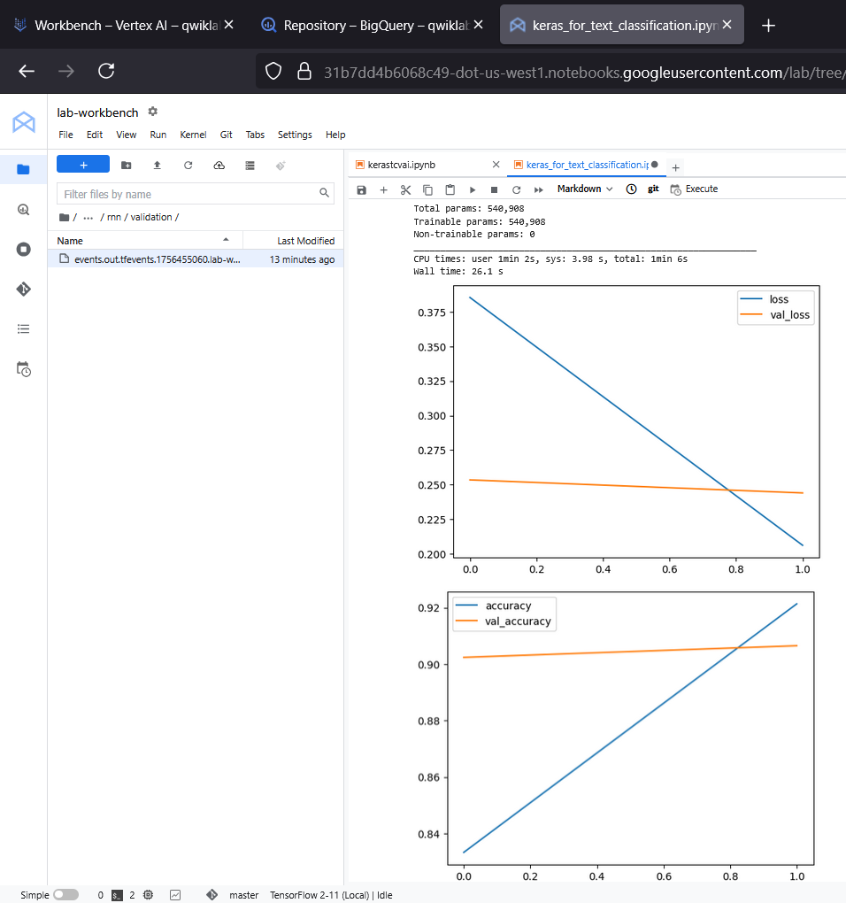